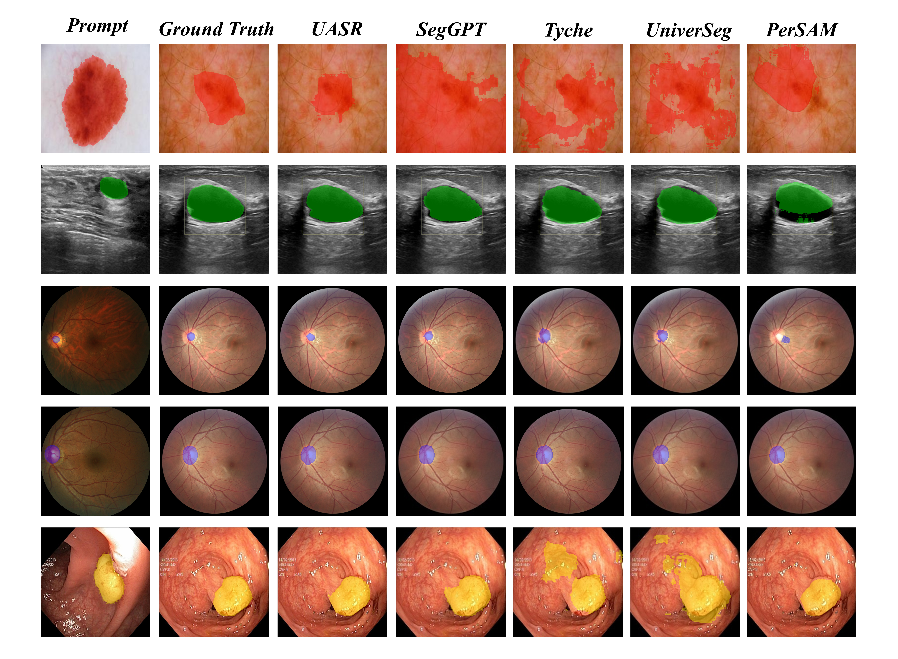

# UASR

## Uncertainty-Aware Structural Representation Learning for Medical In-Context Segmentation

This repository provides the official implementation of **UASR**, 
a novel framework for medical in-context segmentation based on 
uncertainty-aware structural representation learning.

---

## 1. Installation

The main dependencies and their versions are listed in `requirements.txt`.
Please create a Python environment and install the required dependencies according to `requirements.txt`.

```bash
pip install -r requirements.txt
```

## 2. Dataset Preparation

We evaluate UASR on seven publicly available medical image segmentation datasets, including **ISIC2018, BUSI, Kvasir-SEG, REFUGE, PH2, CVC-ClinicDB, and RIM-ONE**.

| Dataset      | Task                                  | Link                                                                 |
| ------------ | ------------------------------------- | -------------------------------------------------------------------- |
| ISIC2018     | Skin Lesion Segmentation              | [Official Website](https://challenge.isic-archive.com/landing/2018/) |
| BUSI         | Breast Ultrasound Image Segmentation  | [Dataset](https://scholar.cu.edu.eg/?q=afahmy/pages/dataset)         |
| Kvasir-SEG   | Polyp Segmentation                    | [Dataset](https://datasets.simula.no/kvasir-seg/)                    |
| REFUGE       | Optic Disc and Optic Cup Segmentation | [Official Website](https://refuge.grand-challenge.org/)              |
| PH2          | Skin Lesion Segmentation              | [Official Website](https://www.fc.up.pt/addi/ph2%20database.html)    |
| CVC-ClinicDB | Polyp Segmentation                    | [Dataset](https://polyp.grand-challenge.org/CVCClinicDB/)            |
| RIM-ONE      | Optic Disc Segmentation               | [Dataset](https://github.com/miag-ull/rim-one-dl)                    |


## 3. Training and Testing

The training and testing procedures are provided as Bash scripts in the `scripts/` directory.

### Training

To train UASR, run the corresponding training script:

```bash
bash train.sh
```

### Testing

After training, run the testing script to evaluate the trained model:

```bash
bash test.sh
```

Please modify the dataset paths, checkpoint paths, and other experimental settings in the corresponding Bash scripts before running them.


## 4. Results

Qualitative Comparison

The qualitative comparison between UASR and existing methods on different medical image segmentation datasets is shown below.




## Citation
If you find this work useful, please consider citing:


